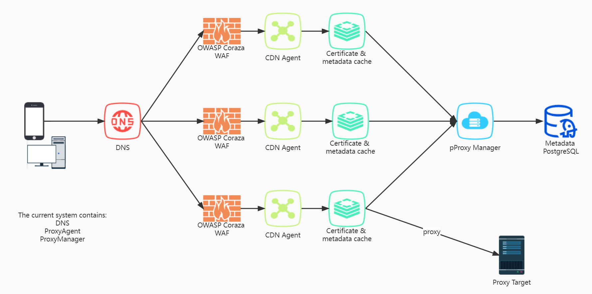

# go-proxy-manager

Corraza-based secure reverse proxy(Alternative to bloated nginx proxy manager)

The current project adopts a split design to accumulate technology for the future cdn

### Design



#### dev: 

嵌入式WAF https://coraza.io/

WAF规则 https://coreruleset.org/installation/

WAF 可靠性测试 https://github.com/wallarm/gotestwaf

Basic plugin dependencies

``` 
go install google.golang.org/protobuf/cmd/protoc-gen-go@v1.28
go install google.golang.org/grpc/cmd/protoc-gen-go-grpc@v1.2
```